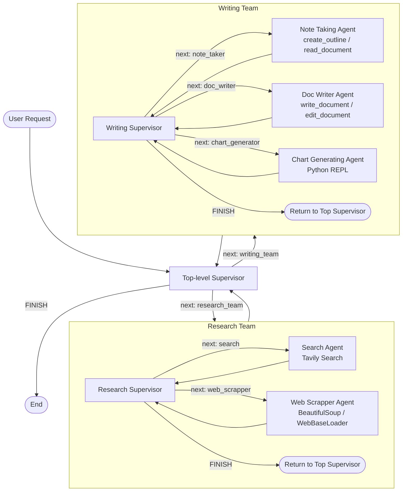

# Personal-Medical-Research-Multi-Agent-System
A multi-agent AI system for scientific research automation, capable of reading papers, extracting structured knowledge, evaluating scientific quality, generating learning material, organizing connected notes in Obsidian, and producing publication-ready LaTeX reports. A LangGraph-based multi-agent system ("DANA") that coordinates two specialized agent teams — **Research** and **Writing** — under supervisor nodes to research a topic and produce a written document.

## Overview

DANA follows a **supervisor-of-supervisors** pattern, a common LangGraph design in which a top-level supervisor routes work between a *research team* and a *writing team* [WIP for extra agents]. Each team has its own internal supervisor that routes work between its member agents.

Every agent reports back to its supervisor, which decides the next step or signals completion with `FINISH`.

## Architecture Diagram



## Key Components

| Component | Type | Role |
|---|---|---|
| `State` | `MessagesState` + `next: str` | Shared graph state passed between all nodes; tracks conversation messages and the next node to run. |
| `make_supervisor_node()` | Factory function | Builds a supervisor node for a given LLM and list of workers. Uses structured output (`Router` `TypedDict`) to select the next worker or `FINISH`. |
| `research_graph` | `StateGraph` | Team graph containing the research supervisor, `search`, and `web_scrapper` nodes. |
| `writing_graph` | `StateGraph` | Team graph containing the writing supervisor, `doc_writer`, `note_taker`, and `chart_generator` nodes. |
| `super_graph` | `StateGraph` | Top-level graph wrapping both team graphs as single callable nodes (`research_team`, `writing_team`) under one top-level supervisor. |

## Tools Defined

| Tool | Purpose |
|---|---|
| `scrape_webpages(urls)` | Loads and returns content from a list of URLs using `WebBaseLoader`. |
| `create_outline(points, file_name)` | Writes a numbered outline to a local file under `temp/`. |
| `read_document(file_name, start, end)` | Reads a document, optionally by line range. |
| `write_document(content, file_name)` | Saves text content to a file (referenced and defined in a truncated cell). |
| `python_repl_tool` | Used by the chart-generating agent to execute Python (referenced but not shown as defined in this notebook). |

## LLM & External Services

- **LLM:** `ChatGroq` running `llama-3.3-70b-versatile` with `temperature=0`.
- **Search:** `TavilySearch` with a maximum of 3 results.
- **Required API keys:** Prompted interactively via `getpass` if they are not already set as environment variables:
  - `OPENAI_API_KEY`
  - `TAVILY_API_KEY`
  - `GROQ_API_KEY`
- **Additional integrations:** `langchain-anthropic` and `langchain_google_genai` are installed but currently unused.

## Notebook Flow

### 1. Preliminary Setup

Installs the required packages and configures the Jupyter environment:

- `langchain_experimental`
- `langchain-groq`
- Jupyter kernel named `DANA system`

### 2. API Keys

Sets the following environment variables using `getpass` when they are not already available:

- `OPENAI_API_KEY`
- `TAVILY_API_KEY`
- `GROQ_API_KEY`

### 3. Imports

Imports the required LangGraph and LangChain modules, including:

- LangGraph
- LangChain Community
- LangChain OpenAI
- Tavily
- Groq
- Google GenAI

### 4. Tools

Defines the document-processing and web-scraping tools used by the agents.

### 5. Supervisor Factory

Defines `make_supervisor_node()`, which is reused to create supervisors for:

- The Research team
- The Writing team
- The top-level system

The supervisor uses structured output through a `Router` `TypedDict` to determine which worker should execute next.

### 6. Agent Teams

#### Research Team

The Research team contains:

- `search` — searches the web using Tavily.
- `web_scrapper` — extracts content from web pages using BeautifulSoup / `WebBaseLoader`.

#### Writing Team

The Writing team contains:

- `doc_writer` — creates and edits the final document.
- `note_taker` — creates outlines and reads documents.
- `chart_generator` — generates charts using a Python REPL.

#### Planned Agents

Several additional agents are planned but currently contain empty or unimplemented cells:

- **Critic**
- **Teacher**
- **Obsidian**
- **LaTeX**

### 7. End-to-End Graph

The two teams are combined under a single top-level supervisor using `super_graph`.

The top-level supervisor can route execution to:

```text
research_team
writing_team
FINISH
```

Each team then delegates the work internally through its own supervisor.

### 8. Visualization

The compiled graph is rendered as a Mermaid diagram using:

```python
super_graph.get_graph().draw_mermaid_png()
```

### 9. Run

A sample request is streamed through the complete graph:

> "Research why gold prices increased in 2025 and compile a report."

The request is processed by the top-level supervisor, which delegates tasks to the appropriate team(s) until the workflow reaches `FINISH`.
